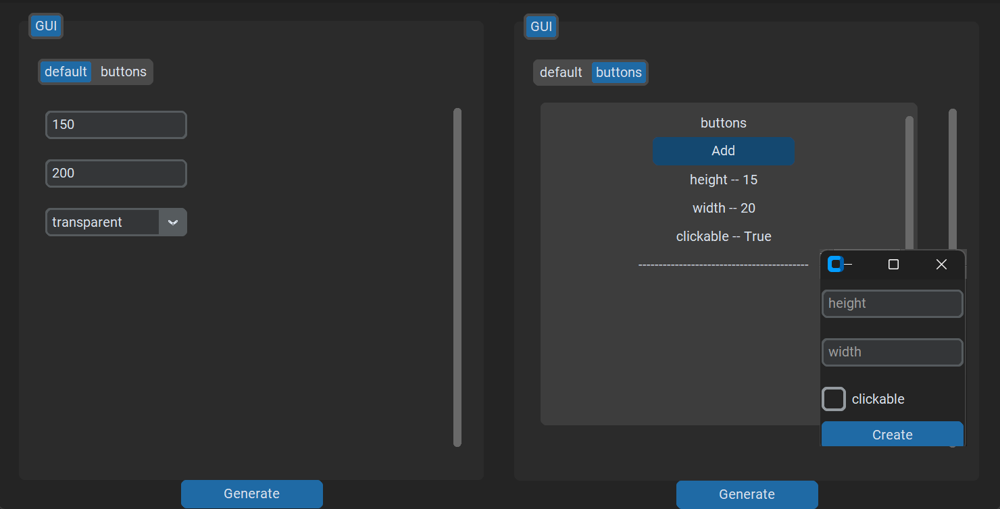

<p align="center">
 
 </p>


# YAMSteak
This software is for generating YAML configuration file through a GUI.
You create a config.yml file and define which fields are needed and define what type of gui element it should be
## Example
##### Config.yml
``` YAML
GUI:
  height:
    type: entry
  width:
    type: entry
  border:
    type: dropdown
    options:
      - rounded
      - transparent
      - none
  buttons:
    type: subsection
    block:
      height:
        type: entry
      width:
        type: entry
      clickable:
        type: checkbox
      
```


<p align="center">
 
</p>


##### Output
``` YAML
GUI:
  border: transparent
  buttons:
  - clickable: true
    height: '15'
    width: '20'
  height: '150'
  width: '200'

```
