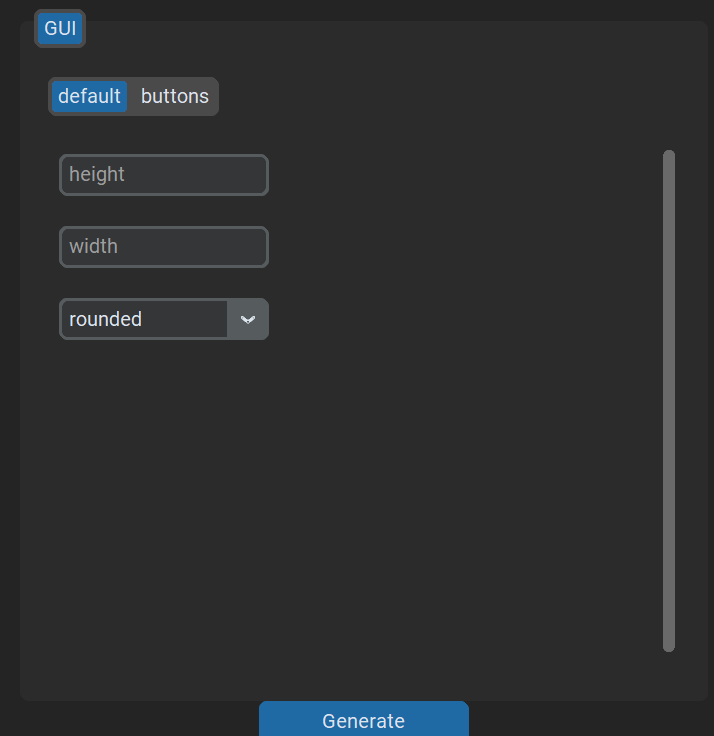
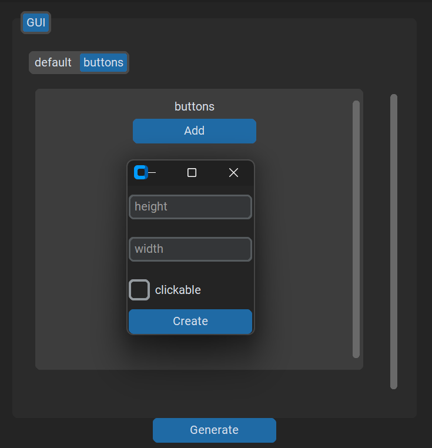

<p align="center">
 
 </p>


# YAMSteak
This software is for generating YAML configuration file through a GUI.
You create a config.yml file and define which fields are needed and define what type of gui element it should be

``` YAML
GUI:
  height:
    type: entry
  width:
    type: entry
  border:
    type: dropdown
    options:
      - rounded
      - transparent
      - none
   buttons:
     type: subsection
     block:
       height:
         type: entry
       width:
         type: entry
       clickable:
         type: checkbox
      
```
<p align="left">
 
 
</p>
